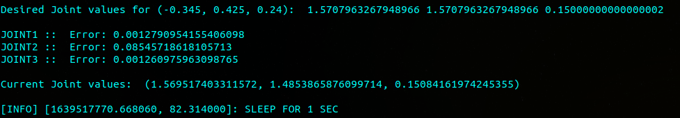
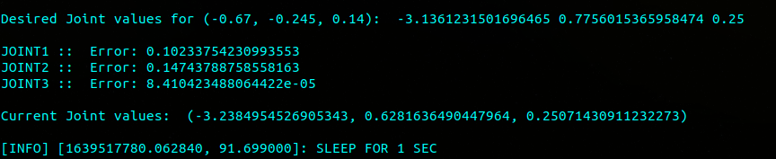

# RBE500 Project

## Instructions
* Run `roslaunch rrp_gazebo gazebo.launch` to bringup gazebo and the rrp bot.
* Run `roslaunch rrp_control rrp_effort_control.launch` for the joint controllers.
* Run `roslaunch rbe500_project rrp.launch` for the PID controller.
* You can modify the desired end-effector `(x, y, z)` positions by changing `self.position_list` in `rrp_pid.py`.
* `rrp_pid.py` saves the trajectories in the `.ros` folder in your home directory as `trajectories.csv`.
* Change the path in `visualize.py` to where the trajectories are saved and run to see the plots of joint values.

## Outputs
* The robot moves to the desired position and waits for `1` second before moving to the next position. The test positions are:

* **`x, y, z = (0, 0.77, 0.34)`**


   
* **`x, y, z = (-0.345, 0.425, 0.24)`**

 


* **`x, y, z = (0.425, 0.344, 0.29)`**

 


* **`x, y, z = (-0.426, -0.344, 0.24)`**

 


* Plot for the 3 joints over time (4 positions):


### Inverse Kinematics Serivce Node
1. Run the node either with `rosrun rbe500_project rrp_ik_server.py` or in a launch file.
2. The service name should appear as `/pos_to_joint_ang`.
3. Call the service with a `geometry_msgs/Point` message as an argument. The fields should correspond to the `x`, `y` and `z` position of the end-effector. 4. The server will then respond with 3 `float64` values for joint 1, joint 2, and joint 3 respectively, in units of radians and meters. The `.srv` file has the folllowing form.
    ```
    geometry_msgs/Point position
    ---
    float64 joint1_ang
    float64 joint2_ang
    float64 joint3_ang
    ```